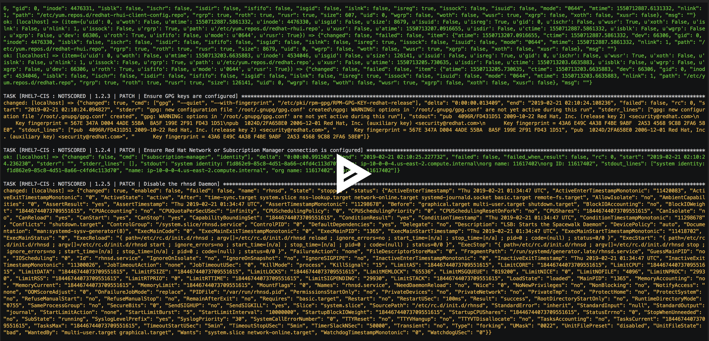

# Example of applying CIS Baseline1 and Baseline2 to RHEL7


## Steps
1. This work is based on [MindPointGroup/RHEL7-CIS](https://github.com/MindPointGroup/RHEL7-CIS)
2. RHEL AMI from Red Hat on AWS
3. You will see a small delay in the middle of the video cast below as the patches are being applied
4. Run the playbook

## Execution 
```
ansible-playbook -v -e "user=ec2-user" --become --key-file "/home/ec2-user/.ssh/id_rsa" playbook.yml
```

## Role Variables
There are many role variables defined in defaults/main.yml. This list shows the most important.

1. rhel7cis_notauto: Run CIS checks that we typically do NOT want to automate due to the high probability of breaking the system (Default: false)
2. rhel7cis_section1: CIS - General Settings (Section 1) (Default: true)
3. rhel7cis_section2: CIS - Services settings (Section 2) (Default: true)
4. rhel7cis_section3: CIS - Network settings (Section 3) (Default: true)
5. rhel7cis_section4: CIS - Logging and Auditing settings (Section 4) (Default: true)
6. rhel7cis_section5: CIS - Access, Authentication and Authorization settings (Section 5) (Default: true)
7. rhel7cis_section6: CIS - System Maintenance settings (Section 6) (Default: true)

## Recording

[](https://asciinema.org/a/A5HZ6A4G8wyoUI2GSg7Brm2KE?autoplay=1&speed=2)
