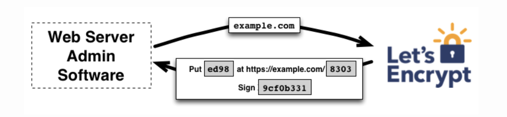
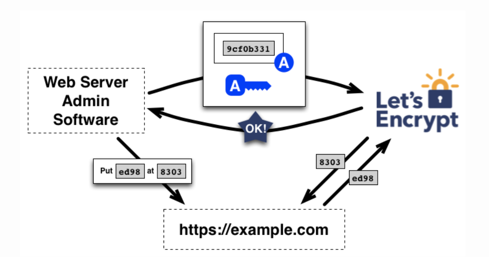
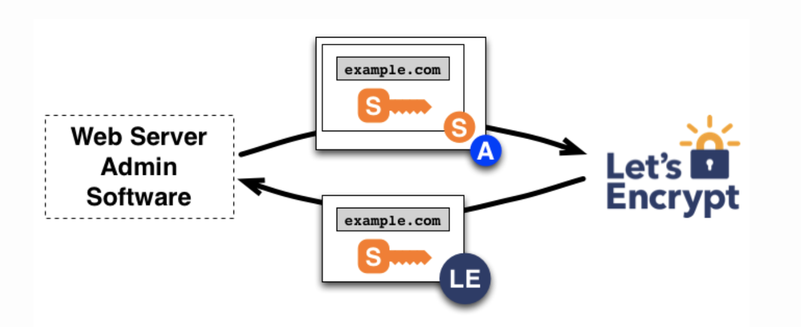
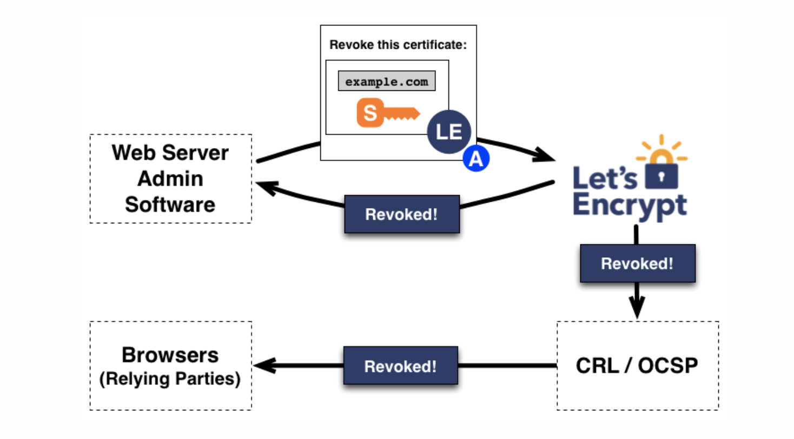

## Notes:
The Automatic Certificate Management Environment (ACME) protocol is a communications protocol for **automating interactions between certificate authorities and their users' web servers**, allowing the automated deployment of public key infrastructure at very low cost. The protocol, based on passing JSON-formatted messages over HTTPS,[2][3] has been published as an Internet Standard in RFC 8555 by its own chartered IETF working group.

**certbot** is Reference Implementation of ACME protocol.

## CA's and PKIs that Support ACME:
1. Buypass
2. Let's Encrypt
3. Entrust
4. GlobalSign
5. Venafi
6. Sectigo (formerly Comodo CA)
7. PrimeKey EJBCA (Enterprise Edition feature)

The first time the agent software interacts with Let’s Encrypt, it generates a new key pair and proves to the Let’s Encrypt CA that the server controls one or more domains. 

## Flow:

1. To kick off the process, the agent asks the Let’s Encrypt CA what it needs to do in order to prove that it controls example.com. The Let’s Encrypt CA will look at the domain name being requested and issue one or more sets of challenges. 

```
1. Provisioning a DNS record under example.com, or
2. Provisioning an HTTP resource under a well-known URI on https://example.com/
```

2. Along with the challenges, the Let’s Encrypt CA also provides a nonce that the agent must sign with its private key pair to prove that it controls the key pair.

3. The agent software completes one of the provided sets of challenges. 

4. The agent also signs the provided nonce with its private key. Once the agent has completed these steps, it notifies the CA that it’s ready to complete validation.

5. Then, it’s the CA’s job to check that the challenges have been satisfied. The CA verifies the signature on the nonce, and it attempts to download the file (assuming challenge #1 was chosen) from the web server and make sure it has the expected content.

6. If the signature over the nonce is valid, and the challenges check out, then the agent identified by the public key is authorized to do certificate management for example.com. We call the key pair the agent used an “authorized key pair” for example.com.

7. Once the agent has an authorized key pair, requesting, renewing, and revoking certificates is simple—just send certificate management messages and sign them with the authorized key pair.

8. Example: To obtain a certificate for the domain, the agent constructs a PKCS#10 Certificate Signing Request that asks the Let’s Encrypt CA to issue a certificate for example.com with a specified public key. As usual, the CSR includes a signature by the private key corresponding to the public key in the CSR. The agent also signs the whole CSR with the authorized key for example.com so that the Let’s Encrypt CA knows it’s authorized.

9. Example: The agent signs a revocation request with the key pair authorized for example.com, and the Let’s Encrypt CA verifies that the request is authorized. If so, it publishes revocation information into the normal revocation channels (i.e. OCSP), so that relying parties such as browsers can know that they shouldn’t accept the revoked certificate.

**Note:** Images below are in the natural flow order described above.




