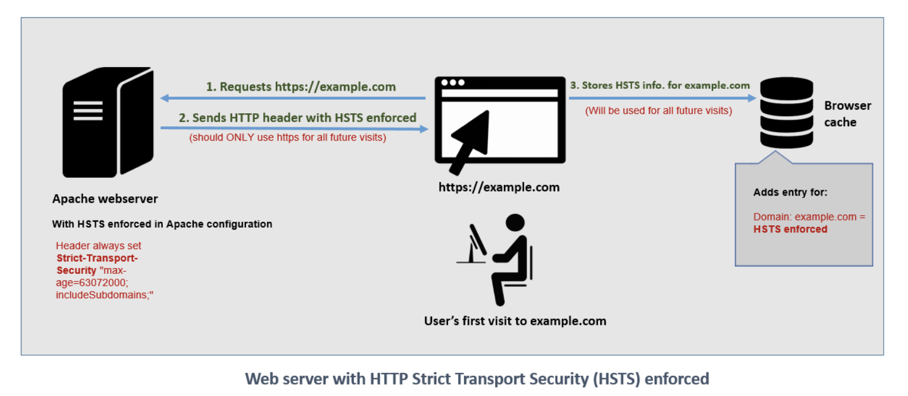

# HSTS

## General Noes

HTTP Strict Transport Security (HSTS) is a web security policy mechanism that helps to protect websites against **protocol downgrade** attacks and **cookie hijacking**

It allows web servers to declare that web browsers (or other complying user agents) 

The HSTS Policy is communicated by the server to the user agent via an HTTPS response header field named "Strict-Transport-Security" to ensure that user agents should interact with it using only secure HTTPS connections, and never via the insecure HTTP protocol.

**For example** A server could send a header such that future requests to the domain for the next year (max-age is specified in seconds; 31,536,000 is equal to one non-leap year) use only HTTPS: 

```
Strict-Transport-Security: max-age=31536000.
```

## Flow

When a web application issues HSTS Policy to user agents, conformant user agents behave as follows:
1. Automatically turn any insecure links referencing the web application into secure links.
2. If the security of the connection cannot be ensured (e.g. the server's TLS certificate is not trusted), the user agent must terminate the connection

## Images

