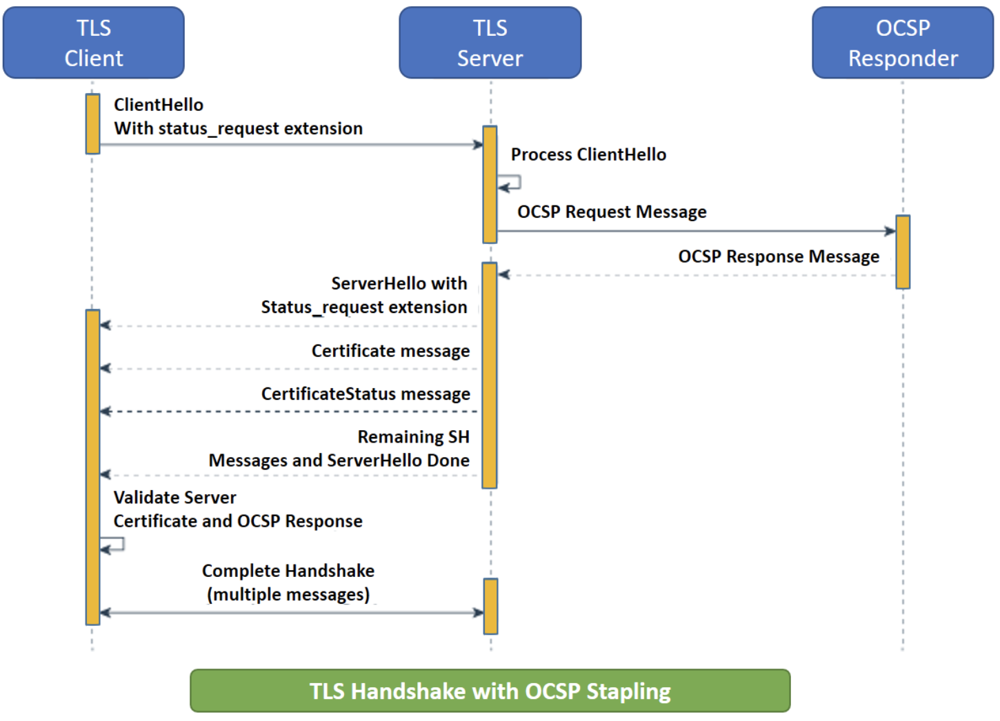
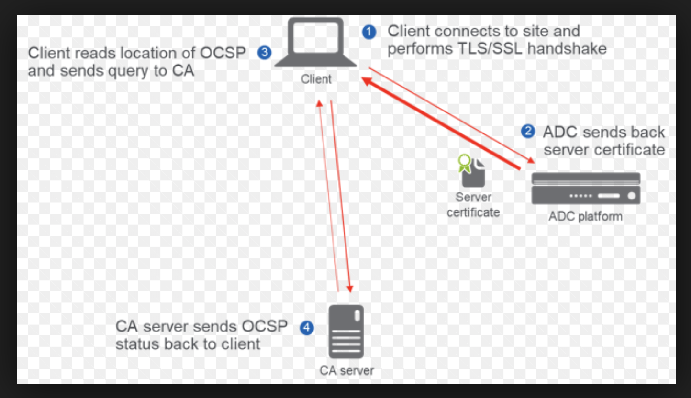

# Online Certificate Status Protocol

## General Notes
Why not CRL ?

Since an OCSP response contains less data than a typical certificate revocation list (CRL), it puts less burden on network and client resources.]
Since an OCSP response has less data to parse, the client-side libraries that handle it can be less complex than those that handle CRLs.
OCSP discloses to the responder that a particular network host used a particular certificate at a particular time. OCSP does not mandate encryption, so other parties may intercept this information.

** Privacy Concern** OCSP requires the client to contact a third party i.e OCSP responder (albeit a party trusted by the client software vendor) to confirm certificate validity. OCSP stapling is a way to verify validity without disclosing browsing behavior to the CA

## Images
OCSP with Stapling

OCSP Without Stapling
)
