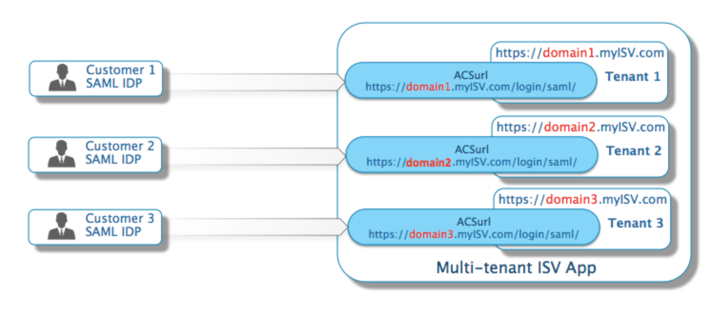
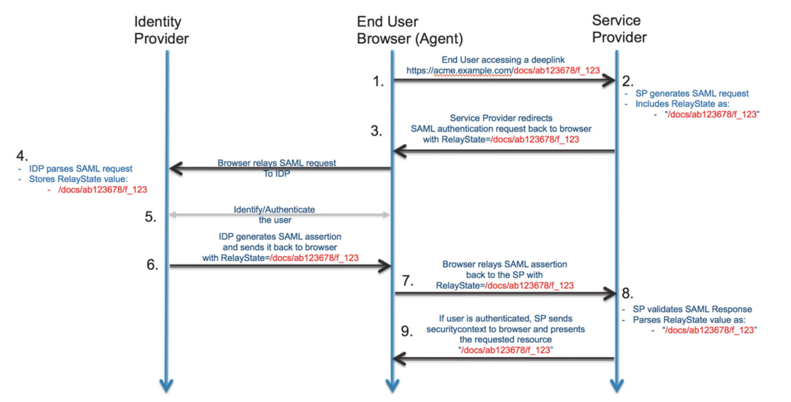

## Notes

SAML is mostly used as a web-based authentication mechanism in a smuch as it relies on using the browser agent to broker the authentication flow.

Info sourced from [here](https://www.okta.com/integrate/documentation/saml/)

A **Service Provider (SP)** is the entity providing the service – typically in the form of an application

An **Identity Provider (IDP)** is the entity providing the identities, including the ability to authenticate a user. The Identity Provider typically also contains the user profile – additional information about the user such as first name, last name, job code, phone number, address, etc. Depending on the application, some service providers may require a very simple profile (username, email), while others may require a richer set of user data (job code, department, address, location, manager, etc).

A **SAML Request**, also known as an authentication request, is generated by the Service Provider to “request” an authentication.

A **SAML Response** is generated by the Identity Provider. It contains the actual assertion of the authenticated user. In addition, a SAML Response may contain additional information, such as user profile information and group/role information, depending on what the Service Provider can support.

A **Service Provider Initiated (SP-initiated)** login describes the SAML login flow when initiated by the Service Provider. This is typically triggered when the end user tries to access a resource or login directly on the Service Provider side, such as when the browser tries to access a protected resource on the Service Provider side.

An **Identity Provider Initiated (IDP-initiated)** login describes the SAML login flow initiated by the Identity Provider. Instead of the SAML flow being triggered by a redirection from the Service Provider, in this flow the Identity Provider initiates a SAML Response that is redirected to the Service Provider to assert the user’s identity.

**Note:**

1. The Service Provider never directly interacts with the Identity Provider. A browser acts as the agent to carry out all the redirections.

2. The Service Provider needs to know which Identity Provider to redirect to before it has any idea who the user is.

3. The Service Provider does not know who the user is until the SAML assertion comes back from the Identity Provider.

4. This flow does not have to start from the Service Provider. An Identity Provider can initiate an authentication flow.

5. The **SAML authentication flow is asynchronous**. The Service Provider does not know if the Identity Provider will ever complete the entire flow. Because of this, the Service Provider does not maintain any state of any authentication requests generated. When the Service Provider receives a response from an Identity Provider, the response must contain all the necessary information.

## SP and IDP
A SAML IDP generates a SAML response based on configuration that is mutually agreed upon by the IDP and the SP. Upon receiving the SAML assertion, the SP needs to validate that the assertion comes from a valid IDP and then parse the necessary information from the assertion – the username, attributes, etc.

In order to do this, the SP requires at least the following:

1. **Certificate –** The SP needs to obtain the public certificate from the IDP to validate the signature. The certificate is stored on the SP side and used whenever a SAML response arrives.
2. **ACS Endpoint –** Assertion Consumer Service URL – often referred to simply as the SP login URL. This is the endpoint provided by the SP where SAML responses are posted. The SP needs to provide this information to the IDP.
3. **IDP Login URL –** This is the endpoint on the IDP side where SAML requests are posted. The SP needs to obtain this information from the IDP.

## Multi-Tenant SP
If you are building a multi-tenant SaaS App where you want to integrate with Tenants IDP then you need to have a separate ACS (Assertion Consumer Service) URL per Tenant.

A key consideration involves the ACSurl endpoint on the SP side where SAML responses are posted. It is **possible** to expose a **single endpoint** even when dealing with multiple IDPs. For a single-instance multi-tenant application where the tenancy is not defined in the URL (such as via a subdomain), this might be a simpler way to implement. However, you must then rely on additional information in the SAML response to determine which IDP is trying to authenticate (for example, using the IssuerID). If your application is architected in a multi-tenant fashion with domain information in the URL (for example, https://domain1.myISV.com or https://www.myISV.com/domain1), then having an ACSurl endpoint for each subdomain might be a good option since the URL itself identifies the domain.

## Relay State
A RelayState is an HTTP parameter that can be included as part of the SAML request and SAML response. In an SP-initiated login flow, the SP can set the RelayState parameter in the SAML request with additional information about the request. A SAML IDP, upon receiving the SAML request, will take the RelayState value and simply attach it back as a HTTP parameter in the SAML response after the user has been authenticated. This way, when the round trip completes, the SP can use the RelayState information to get additional context about the initial SAML authentication request.

In the case of a deep link, the SP sets the RelayState of the SAML request with the deep-link value. When the SAML response comes back, the SP can use the RelayState value and take the authenticated user to the right resource.

## Implementing a Back Door
This is particularly important where the entire population is intended to be SAML-enabled in your application. Sometimes, there might be a mistake in the SAML configuration – or something changes in SAML IDP endpoints. In any case, you do not want to be completely locked out. Having a backdoor available for administrator(s) to use to access a locked system becomes extremely important. 

This is often accomplished by having a “secret” login URL that does not trigger a SAML redirection when accessed. Typically, the administrator will use a username/password to login in and make the necessary changes to fix the problem.

