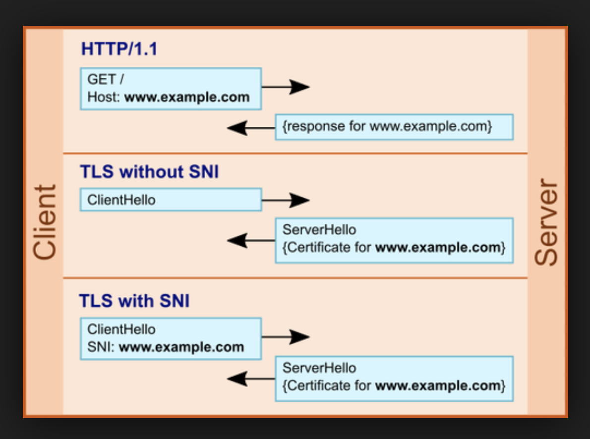

# Server Name Indication

## General Notes

It is the conceptual equivalent to HTTP/1.1 **name-based virtual hosting** (for HTTP the name is presented in the host header), but for HTTPS. SNI headers are sent as part of the **Client Hello**

Server Name Indication (SNI) is an extension to the TLS computer networking protocol by which a client indicates which hostname it is attempting to connect to at the start of the handshaking process. This allows a server to present multiple certificates on the same IP address and TCP port number and hence allows multiple secure (HTTPS) websites (or any other service over TLS) to be served by the same IP address without requiring all those sites to use the same certificate.

## Security Implications
The desired hostname is not encrypted, so an eavesdropper can see which site is being requested. This infact helps in the following way - This helps security companies provide a filtering feature and governments implement censorship.

## Images

